# 02 — Database Schema & ER Diagram

PostgreSQL (Neon) · Prisma ORM · strict typing end-to-end.

## Design rules

1. **Reference data is separate from user data.** `College*Template` tables are global,
   cycle-versioned, seeded. User rows *copy from* them and record provenance so a
   reference-data update never silently overwrites a student's override.
2. **Provenance on everything derived.** `origin: SEEDED | DERIVED | USER`, plus
   `sourceTemplateId`, `confidence`, `verifiedAt`.
3. **Two-phase completion.** Requirements track `submittedAt` **and** `confirmedReceivedAt`.
   Research says the failure mode is post-submission, not pre. (P-03)
4. **Polymorphic links via nullable typed FKs**, not string columns — real referential
   integrity, real cascade behavior, indexable.
5. **Money in integer cents.** No floats, ever.
6. **All timestamps `timestamptz`.** Deadlines additionally carry an IANA `timezone`
   string because "Jan 1, 11:59pm" means the *college's* midnight.
7. **Soft delete** (`archivedAt`) on user-authored content; hard delete on join rows.
8. **Every table stays `userId`-scoped even though the app is currently single-user.**
   A fixed local user is seeded and every service takes a `userId` exactly as designed, so
   adding real authentication later is a drop-in change with no migration and no service
   rewrites.

---

## ER Diagram

```mermaid
erDiagram
    User ||--o| StudentProfile : has
    User ||--o| UserSettings : has
    User ||--o{ Account : "oauth"
    User ||--o{ Session : has
    User ||--o{ TestScore : records
    User ||--o{ Application : owns
    User ||--o{ Essay : writes
    User ||--o{ Task : owns
    User ||--o{ Scholarship : tracks
    User ||--o{ Recommender : knows
    User ||--o{ Document : uploads
    User ||--o{ Note : writes
    User ||--o{ Notification : receives
    User ||--o{ ActivityEvent : generates
    User ||--o{ CalendarEvent : has
    User ||--o{ Milestone : achieves
    User ||--o| FinancialAidProfile : has
    User ||--o{ Collaborator : invites

    College ||--o{ Application : "applied to"
    College ||--o{ CollegeDeadlineTemplate : defines
    College ||--o{ CollegeRequirementTemplate : defines
    College ||--o{ EssayPromptTemplate : publishes
    College ||--o{ Visit : "visited"

    Application ||--o{ Requirement : "checklist"
    Application ||--o{ Deadline : has
    Application ||--o{ EssayPrompt : asks
    Application ||--o{ Recommendation : needs
    Application ||--o{ AidRequirement : needs
    Application ||--o| AidAward : "offered"
    Application ||--o| Interview : has
    Application ||--o{ Task : "spawns"
    Application ||--o{ Note : annotated
    Application ||--o{ Document : attaches
    Application ||--o| PortalAccount : "tracked by"

    Essay ||--o{ EssayVersion : "history"
    Essay ||--o{ EssayAssignment : "used for"
    EssayPrompt ||--o{ EssayAssignment : "answered by"
    Scholarship ||--o{ EssayAssignment : "answered by"
    EssayVersion ||--o{ EssayComment : "annotated"
    EssayVersion ||--o{ EssayAssignment : "submitted as"

    Recommender ||--o{ Recommendation : writes

    Task ||--o{ Task : "subtasks"
    Task ||--o{ TaskDependency : "blocks"

    FinancialAidProfile ||--o{ AidRequirement : governs
    Scholarship ||--o{ Task : "spawns"
    Deadline ||--o| CalendarEvent : "projects to"
```



---

## Schema (Prisma, abridged to the meaningful parts)

### Identity & profile

```prisma
model User {
  id             String    @id @default(cuid())
  email          String    @unique
  emailVerified  DateTime?
  hashedPassword String?              // null for OAuth-only accounts
  name           String?
  image          String?
  createdAt      DateTime  @default(now())
  updatedAt      DateTime  @updatedAt
  // …relations
}

model Account {                        // Google OAuth
  id, userId, provider, providerAccountId, refresh_token, access_token, expires_at …
  @@unique([provider, providerAccountId])
}

model Session          { id, sessionToken @unique, userId, expires }
model VerificationToken { identifier, token @unique, expires, @@unique([identifier, token]) }
model PasswordResetToken{ id, userId, tokenHash @unique, expiresAt, usedAt }

model StudentProfile {
  id, userId @unique
  graduationYear    Int
  highSchoolName    String?
  ceebCode          String?
  gpaUnweighted     Decimal? @db.Decimal(4,3)
  gpaWeighted       Decimal? @db.Decimal(4,3)
  classRank         Int?
  classSize         Int?
  intendedMajors    String[]
  residencyState    String?
  citizenship       CitizenshipStatus?
  isFirstGeneration Boolean  @default(false)
  needsFinancialAid Boolean  @default(true)
  feeWaiverEligible Boolean  @default(false)
  parentsSeparated  Boolean  @default(false)   // ⇒ noncustodial CSS Profile required
  questBridgeStatus QuestBridgeStatus @default(NOT_APPLICABLE)
  ferpaWaiverSignedAt DateTime?                // gates the entire rec pipeline
}

model TestScore {
  id, userId
  type      TestType        // SAT ACT AP IB TOEFL IELTS SAT_SUBJECT PSAT
  label     String?         // "AP Biology"
  score     Int
  subscores Json?
  takenOn   DateTime
  isSuperscoreEligible Boolean @default(true)
  sendStatus TestSendStatus  @default(NOT_SENT)
}

model UserSettings {
  id, userId @unique
  theme            Theme    @default(SYSTEM)
  timezone         String   @default("America/New_York")
  weekStartsOn     Int      @default(0)
  digestFrequency  DigestFrequency @default(DAILY)
  digestHourLocal  Int      @default(8)
  reminderOffsetsDays Int[] @default([30,14,7,3,1,0])
  recLeadTimeDays  Int      @default(28)   // back-scheduling lead for rec asks
  essayLeadTimeDays Int     @default(21)
  emailNotifications Boolean @default(true)
  pushNotifications  Boolean @default(false)
  reduceMotion       Boolean @default(false)
  confettiEnabled    Boolean @default(true)
}
```

### Reference data (global, seeded, cycle-versioned)

```prisma
model College {
  id, slug @unique
  name             String
  aliases          String[]           // "Cal", "UMich" → search
  city, state, country
  ipedsId          String?  @unique
  type             CollegeType        // PUBLIC PRIVATE_NONPROFIT PRIVATE_FORPROFIT
  platforms        ApplicationPlatform[]   // COMMON_APP COALITION UC APPLY_TEXAS DIRECT
  isQuestBridgePartner Boolean @default(false)
  requiresCssProfile   Boolean @default(false)
  isNeedBlind          Boolean @default(false)
  meetsFullNeed        Boolean @default(false)
  admitRate            Decimal? @db.Decimal(5,4)
  sat25, sat75, act25, act75  Int?
  costOfAttendanceCents Int?
  testPolicy           TestPolicy      // REQUIRED OPTIONAL BLIND
  interviewPolicy      InterviewPolicy // NONE OPTIONAL_INFORMATIONAL OPTIONAL_EVALUATIVE REQUIRED
  requiredTeacherRecs  Int  @default(0)
  requiresCounselorRec Boolean @default(false)
  maxTeacherRecs       Int?
  website, admissionsUrl, netPriceCalculatorUrl, portalUrlHint  String?
  @@index([name]) @@index([state])
}

model CollegeDeadlineTemplate {
  id, collegeId, cycleYear Int        // e.g. 2026 = entering fall 2026
  round      ApplicationRound
  kind       DeadlineKind             // APPLICATION CSS_PROFILE FAFSA_PRIORITY SCHOLARSHIP
                                      // HONORS FINANCIAL_AID INTERVIEW_REQUEST DECISION_RELEASE
  date       DateTime
  timezone   String   @default("America/New_York")
  confidence Confidence @default(HIGH)
  sourceUrl  String?
  @@unique([collegeId, cycleYear, round, kind])
}

model CollegeRequirementTemplate {
  id, collegeId, cycleYear, round
  type       RequirementType
  isRequired Boolean @default(true)
  detail     String?
  @@index([collegeId, cycleYear])
}

model EssayPromptTemplate {
  id, collegeId, cycleYear, round
  platform   ApplicationPlatform
  prompt     String   @db.Text
  wordMin, wordMax   Int?
  isRequired Boolean  @default(true)
  promptKind PromptKind      // WHY_US WHY_MAJOR COMMUNITY DIVERSITY ACTIVITY
                             // INTELLECTUAL_INTEREST SHORT_ANSWER CREATIVE OTHER
  topicTags  String[]        // powers reuse scoring
}
```

`promptKind` + `topicTags` + word-limit distance are exactly what the reuse engine scores
on. Seeding them well is the difference between a useful suggestion and a gimmick.

### Applications — the spine

```prisma
model Application {
  id, userId, collegeId
  cycleYear    Int
  round        ApplicationRound
  platform     ApplicationPlatform
  tier         SchoolTier?           // REACH TARGET LIKELY
  status       ApplicationStatus @default(RESEARCHING)
  priority     Int      @default(2)
  intendedMajor String?
  isHonorsProgram Boolean @default(false)

  submittedAt        DateTime?
  applicationFeeCents Int?
  feeWaiverApplied   Boolean  @default(false)

  decision     DecisionOutcome?      // ACCEPTED DENIED DEFERRED WAITLISTED MATCHED WITHDRAWN
  decidedAt    DateTime?
  isBindingCommitment Boolean @default(false)
  enrollmentDepositPaidAt DateTime?

  archivedAt   DateTime?
  @@unique([userId, collegeId, cycleYear])
  @@index([userId, status]) @@index([userId, round])
}

model PortalAccount {
  id, applicationId @unique
  url            String
  username       String?              // ⚠ passwords are never stored
  applicantId    String?
  lastCheckedAt  DateTime?
  notes          String?
}

model Requirement {
  id, applicationId
  type        RequirementType         // ESSAY TEACHER_REC COUNSELOR_REC SCHOOL_REPORT
                                      // MID_YEAR_REPORT FINAL_REPORT TRANSCRIPT TEST_SCORES
                                      // PORTFOLIO INTERVIEW FEE_OR_WAIVER CSS_PROFILE
                                      // FAFSA IDOC NONCUSTODIAL_PROFILE SUPPLEMENT_FORM
                                      // AUDITION LOCI OTHER
  label       String
  isRequired  Boolean  @default(true)
  status      RequirementStatus @default(NOT_STARTED)
  dueAt       DateTime?
  submittedAt          DateTime?
  confirmedReceivedAt  DateTime?      // ← the portal-sweep field (P-03)
  origin      Origin   @default(DERIVED)
  sourceTemplateId String?
  isUserOverridden Boolean @default(false)

  essayPromptId  String?  @unique
  recommendationId String? @unique
  documentId     String?
  @@index([applicationId, status])
}

model Deadline {
  id, userId
  applicationId String?
  scholarshipId String?
  kind        DeadlineKind
  title       String
  dueAt       DateTime
  timezone    String   @default("America/New_York")
  isHard      Boolean  @default(true)   // hard = external; soft = our back-scheduled target
  origin      Origin   @default(DERIVED)
  confidence  Confidence @default(HIGH)
  verifiedAt  DateTime?
  sourceUrl   String?
  completedAt DateTime?
  @@index([userId, dueAt])
}
```

### Essays — the graph

```prisma
model Essay {
  id, userId
  title       String
  promptText  String?  @db.Text
  wordLimit, charLimit Int?
  status      EssayStatus @default(NOT_STARTED)  // NOT_STARTED BRAINSTORM OUTLINE
                                                 // DRAFTING REVISING REVIEW FINAL SUBMITTED
  promptKind  PromptKind @default(OTHER)
  topicTags   String[]
  isMaster    Boolean  @default(false)   // e.g. the Common App personal statement
  currentVersionId String? @unique
  parentEssayId    String?               // lineage when adapted from another essay
  archivedAt  DateTime?
  @@index([userId, status])
}

model EssayVersion {
  id, essayId
  versionNumber Int
  label         String?           // "after Ms. Chen's edits"
  content       String  @db.Text
  wordCount, charCount, readingTimeSeconds Int
  createdAt     DateTime @default(now())
  isAutosave    Boolean @default(true)
  @@unique([essayId, versionNumber])
}

model EssayAssignment {                // essay ↔ target, many-to-many
  id, essayId
  applicationId String?
  essayPromptId String?
  scholarshipId String?
  status        AssignmentStatus @default(PLANNED)  // PLANNED ADAPTING READY SUBMITTED
  submittedVersionId String?          // exactly which text went to this school
  submittedAt   DateTime?
  fitWarnings   Json?                 // {overWordLimit: 42, foreignCollegeMentions:["Michigan"]}
  @@unique([essayId, essayPromptId])
  @@unique([essayId, scholarshipId])
}

model EssayPrompt {
  id, applicationId
  sourceTemplateId String?
  prompt      String @db.Text
  wordMin, wordMax Int?
  isRequired  Boolean @default(true)
  promptKind  PromptKind @default(OTHER)
  topicTags   String[]
}

model EssayComment {
  id, essayVersionId
  authorUserId  String?              // null ⇒ external reviewer via share link
  authorName    String?
  quotedText    String?  @db.Text
  rangeStart, rangeEnd Int?
  body          String   @db.Text
  resolvedAt    DateTime?
}
```

### Recommendations, aid, scholarships, interviews

```prisma
model Recommender {
  id, userId
  name, email
  role         RecommenderRole   // TEACHER COUNSELOR MENTOR EMPLOYER COACH PEER OTHER
  subject, relationship, phone, notes
  bragSheetDocumentId String?
  maxLettersWilling   Int?
}

model Recommendation {
  id, recommenderId, applicationId
  status      RecommendationStatus @default(NOT_ASKED)
              // NOT_ASKED ASKED AGREED DECLINED INVITED IN_PROGRESS SUBMITTED CONFIRMED
  askedAt, agreedAt, invitedAt, submittedAt, confirmedReceivedAt, thankedAt  DateTime?
  dueAt       DateTime?
  @@unique([recommenderId, applicationId])
}

model FinancialAidProfile {
  id, userId @unique
  fafsaSubmittedAt   DateTime?
  fafsaConfirmation  String?
  studentAidIndex    Int?
  fsaIdCreatedAt     DateTime?
  cssProfileSubmittedAt DateTime?
  cssFeeWaiverGranted   Boolean @default(false)
  noncustodialRequired  Boolean @default(false)
  noncustodialSubmittedAt DateTime?
  idocStatus         IdocStatus @default(NOT_REQUIRED)
  verificationSelected Boolean @default(false)
}

model AidRequirement {
  id, userId, applicationId String?
  kind    AidRequirementKind  // FAFSA CSS_PROFILE NONCUSTODIAL_PROFILE IDOC_DOCUMENT
                              // INSTITUTIONAL_FORM VERIFICATION TAX_RETURN W2 BUSINESS_SUPPLEMENT
  label   String
  dueAt   DateTime?
  status  RequirementStatus @default(NOT_STARTED)
  documentId String?
}

model AidAward {                       // all cents; net price computed, never stored wrong
  id, applicationId @unique
  costOfAttendanceCents  Int
  tuitionFeesCents, roomBoardCents, booksOtherCents  Int?
  institutionalGrantCents, federalGrantCents, stateGrantCents,
  meritScholarshipCents, outsideScholarshipCents      Int @default(0)
  workStudyCents, subsidizedLoanCents, unsubsidizedLoanCents,
  parentPlusLoanCents                                 Int @default(0)
  awardLetterDocumentId String?
  appealStatus AppealStatus @default(NONE)
  receivedAt   DateTime?
  // netPriceCents = COA − (all *Grant* + *Scholarship*).  Loans & work-study excluded.
}

model Scholarship {
  id, userId
  name, provider, url
  amountCents      Int?
  isRenewable      Boolean @default(false)
  scope            ScholarshipScope  // LOCAL REGIONAL STATE NATIONAL INSTITUTIONAL
  effortEstimateMinutes Int?
  deadlineAt       DateTime?
  status           ScholarshipStatus @default(SAVED)
                   // SAVED IN_PROGRESS SUBMITTED AWARDED REJECTED NOT_PURSUED
  awardedAmountCents Int?
  requirementsNote String?
  // expectedValue = amountCents / max(effortEstimateMinutes,1) × scopeMultiplier
}

model Interview {
  id, applicationId @unique
  type        InterviewType   // ALUMNI ON_CAMPUS VIRTUAL FACULTY GROUP
  isEvaluative Boolean @default(true)
  status      InterviewStatus @default(NOT_AVAILABLE)
              // NOT_AVAILABLE AVAILABLE REQUESTED SCHEDULED COMPLETED DECLINED WAIVED
  requestByAt, completeByAt, scheduledAt  DateTime?
  interviewerName, interviewerEmail, location, prepNotes, reflectionNotes
  thankYouSentAt DateTime?
}

model Visit {
  id, userId, collegeId
  type     VisitType  // CAMPUS_TOUR INFO_SESSION OVERNIGHT VIRTUAL_TOUR COLLEGE_FAIR CLASS_VISIT
  occurredAt DateTime
  rating   Int?       // 1–5
  notes    String?
  countsAsDemonstratedInterest Boolean @default(true)
}
```

### Tasks, calendar, documents, notes, events

```prisma
model Task {
  id, userId
  title, description
  status     TaskStatus  @default(TODO)   // TODO IN_PROGRESS BLOCKED DONE CANCELLED
  priority   Int         @default(2)      // 0 = urgent … 3 = low
  labels     String[]
  dueAt, startAt, completedAt  DateTime?
  estimateMinutes Int?
  sortOrder  Float       @default(0)      // fractional indexing for drag & drop
  parentTaskId  String?
  applicationId, essayId, scholarshipId, recommendationId, aidRequirementId  String?
  recurrenceRule String?                  // RFC 5545 RRULE
  recurrenceParentId String?
  isAutoGenerated Boolean @default(false)
  generatorKey    String?                 // idempotency: "rec-ask:{recId}"
  @@unique([userId, generatorKey])
  @@index([userId, status, dueAt])
}

model TaskDependency {
  id, blockingTaskId, blockedTaskId
  @@unique([blockingTaskId, blockedTaskId])
}

model CalendarEvent {
  id, userId
  title, description, location
  startAt, endAt  DateTime
  isAllDay   Boolean @default(false)
  type       CalendarEventType  // DEADLINE TASK INTERVIEW VISIT DECISION_RELEASE PERSONAL
  deadlineId, taskId, interviewId, visitId, applicationId  String?
  externalUid String?  @unique      // stable UID for the .ics feed
  @@index([userId, startAt])
}

model Document {
  id, userId
  name, type DocumentType  // TRANSCRIPT RESUME BRAG_SHEET AWARD_LETTER TAX_RETURN W2
                           // ESSAY_EXPORT PORTFOLIO TEST_REPORT ACCEPTANCE_LETTER OTHER
  uploadThingKey String @unique
  url, mimeType  String
  sizeBytes      Int
  applicationId, scholarshipId, aidRequirementId  String?
  @@index([userId, type])
}

model Note {
  id, userId
  title      String?
  content    Json                  // rich-text document
  plainText  String @db.Text       // for full-text search
  isPinned   Boolean @default(false)
  applicationId, collegeId  String?
  archivedAt DateTime?
}

model ActivityEvent {                // powers both the activity feed and /timeline
  id, userId
  entityType EntityType
  entityId   String
  action     ActivityAction  // CREATED UPDATED STATUS_CHANGED COMPLETED SUBMITTED
                             // DECISION_RECORDED VERSION_SAVED COMMENTED DELETED
  summary    String
  metadata   Json?
  isMilestone Boolean @default(false)
  occurredAt DateTime @default(now())
  @@index([userId, occurredAt])
}

model Notification {
  id, userId
  type       NotificationType  // DEADLINE_APPROACHING OVERDUE REC_STALE PORTAL_SWEEP
                               // DECISION_EXPECTED MILESTONE DIGEST RULE_VIOLATION
  title, body
  entityType EntityType?
  entityId   String?
  scheduledFor DateTime?
  sentAt, readAt, dismissedAt  DateTime?
  channels   NotificationChannel[]
  @@index([userId, readAt])
}

model Milestone {                     // confetti triggers
  id, userId
  kind       MilestoneKind  // FIRST_APPLICATION FIRST_SUBMISSION ALL_EARLY_SUBMITTED
                            // ALL_ESSAYS_DONE ALL_RECS_IN FAFSA_FILED FIRST_ACCEPTANCE
                            // ALL_SUBMITTED FULLY_FUNDED COMMITTED
  achievedAt DateTime @default(now())
  celebratedAt DateTime?
  metadata   Json?
  @@unique([userId, kind])
}

model Collaborator {                  // parent / counselor guest access
  id, ownerUserId
  email      String
  role       CollaboratorRole  // PARENT_VIEWER COUNSELOR_REVIEWER ESSAY_REVIEWER
  scopes     CollaboratorScope[]  // APPLICATIONS DEADLINES FINANCIAL_AID ESSAYS_SHARED TASKS
  inviteTokenHash String @unique
  acceptedAt, revokedAt, expiresAt DateTime?
  @@unique([ownerUserId, email])
}

model RuleFinding {                   // cached rule-engine output
  id, userId
  code       RuleCode  // MULTIPLE_BINDING_ED, REA_EXCLUSIVITY, QUESTBRIDGE_ED_CONFLICT,
                       // ED_ACCEPTED_MUST_WITHDRAW, FINAL_REPORT_ORDERING,
                       // MISSING_FERPA_WAIVER, UNBALANCED_LIST, DEADLINE_OVERLOAD
  severity   Severity  // BLOCKER WARNING INFO
  message, explanation, citationUrl
  entityIds  String[]
  dismissedAt DateTime?
  resolvedAt  DateTime?
  @@unique([userId, code, entityKey])
}
```

---

## Derived Logic

### 7.1 Next-Best-Action score

Computed server-side; deterministic, explainable, and shown as a "why this?" tooltip.

```
score =  urgency × 40
       + criticality × 25
       + unblockedReadiness × 15
       + dependencyFanout × 10
       + quickWinBonus × 5
       + stalenessNudge × 5

urgency            = clamp(1 − daysUntilDue / 30, 0, 1); overdue ⇒ 1.2
criticality        = P0 1.0 | P1 0.75 | P2 0.5 | P3 0.25;
                     ×1.5 if blocking a HARD external deadline
unblockedReadiness = 0 if any blocking task incomplete   (blocked work is never suggested)
dependencyFanout   = normalized count of tasks this unblocks
                     (rec asks and FERPA waivers score enormous here — correctly)
quickWinBonus      = 1 if estimate ≤ 15 min
stalenessNudge     = 1 if in-progress and untouched > 7 days
```

### 7.2 Progress rings

```
Application completion = Σ(weight × status) / Σ(weight) over required Requirements
  weights: ESSAY 3 · TEACHER_REC 2 · COUNSELOR_REC 2 · SCHOOL_REPORT 2
           TRANSCRIPT 2 · TEST_SCORES 1 · FEE_OR_WAIVER 1 · other 1
  status:  NOT_STARTED 0 · IN_PROGRESS 0.5 · SUBMITTED 0.9 · CONFIRMED_RECEIVED 1.0
```
Submitted caps at 0.9 — the last 10% is portal confirmation. That gap *is* the product's
core opinion, rendered as a number. (P-03)

### 7.3 Essay reuse score

```
reuse =  0.45 × promptKindMatch          (exact 1.0 · adjacent 0.5 · none 0)
       + 0.25 × jaccard(topicTags)
       + 0.20 × wordLimitFit             (1 − |targetLimit − sourceWords|/targetLimit)
       + 0.10 × sourceMaturity           (FINAL 1.0 · REVISING 0.7 · DRAFTING 0.3)

Hard gates:
  • Cross-platform UC ⇄ Common App suggestions are demoted and carry an explicit
    "these require rewriting, not trimming" warning.  (Research §1.2)
  • Any suggestion whose source names a different college surfaces the swap list first.
```

### 7.4 Back-scheduling (soft deadlines from hard ones)

```
hardDeadline D ⇒
  essay first draft        D − 21d
  essay final              D −  7d
  rec ask                  D − 28d   (blocked by FERPA waiver)
  rec nudge                D − 14d   if not SUBMITTED
  counselor form request   D − 21d
  transcript request       D − 21d
  test score send          D − 14d
  CSS Profile              per-college template, else D
  final review + submit    D −  2d   ← never D; submission-night outages are documented
  portal verification      D +  7d, +14d
```

### 7.5 Rule engine (evaluated on every application mutation)

| Code | Trigger | Severity |
|---|---|---|
| `MULTIPLE_BINDING_ED` | >1 non-withdrawn ED1/ED2 application | BLOCKER |
| `REA_EXCLUSIVITY` | REA/SCEA app + any other private early app | BLOCKER |
| `QUESTBRIDGE_ED_CONFLICT` | QB ranking + binding ED at another school | BLOCKER |
| `ED_ACCEPTED_MUST_WITHDRAW` | ED accepted + other apps still open | BLOCKER → task set |
| `FINAL_REPORT_ORDERING` | Final Report before Mid-Year sent | WARNING |
| `MISSING_FERPA_WAIVER` | rec invites pending, waiver unsigned | WARNING |
| `DEADLINE_OVERLOAD` | > 20 est. hours due in a 7-day window | INFO |
| `UNBALANCED_LIST` | 0 Likely schools, or > 70% Reach | INFO |

---

## Indexing & Search

- Composite indexes on every `(userId, <sort field>)` access path listed above.
- Full-text: a `search_document` materialized view unioning colleges, applications,
  essays, tasks, scholarships, notes, and recommenders into `(userId, entityType,
  entityId, title, body, tsv)` with a GIN index on `tsv` — plus `pg_trgm` on `title` for
  fuzzy/typo-tolerant matching. Refreshed by trigger on write.
- ⌘K queries the view with `websearch_to_tsquery`, ranked by `ts_rank_cd` and boosted for
  recency and entity type.
